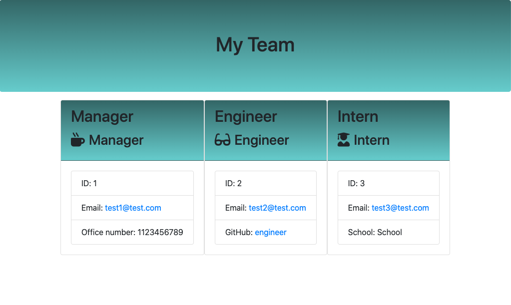

# Module 12 Object-Oriented Programming: Team Profile Generator

## User Story

As a manager a user want to generate a webpage that displays my team's basic info so that a user have quick access to their emails and GitHub profiles.

## Instructions

* Run the app by invoking:
```bash
node index.js

```
     
    
    * When a user starts the application then they are prompted to enter the **team manager**’s:
      * Name
      * Employee ID
      * Email address
      * Office number
    * When a user enters those requirements then the user is presented with a menu with the option to:
      * Add an engineer
      * Add an intern 
      * Finish building the team
    * When a user selects the **engineer** option then a user is prompted to enter the following and then the user is taken back to the menu:
      * Engineer's Name
      * ID
      * Email
      * GitHub username
    * When a user selects the intern option then a user is prompted to enter the following and then the user is taken back to the menu:
      * Intern’s name
      * ID
      * Email
      * School
    * When a user decides to finish building their team then they exit the application, and the HTML is generated.
  

---

## Mock-Up

The following image shows a mock-up of the generated HTML’s appearance and functionality:



---

## Review

You are required to submit the following for review:

* The URL of the GitHub repository.

https://github.com/kevmcgowan/profile_generator

---
© 2022 Kevin McGowan. Confidential and Proprietary. All Rights Reserved.

